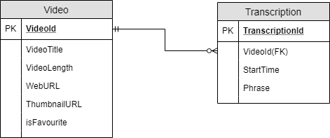
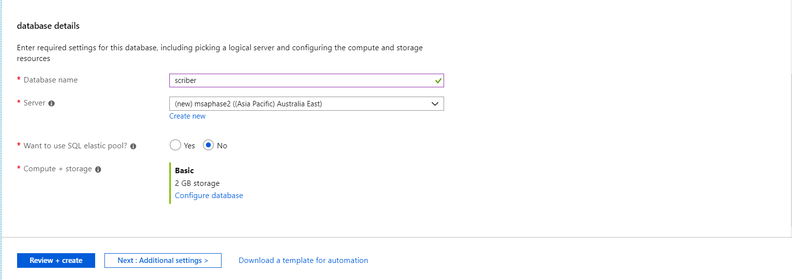
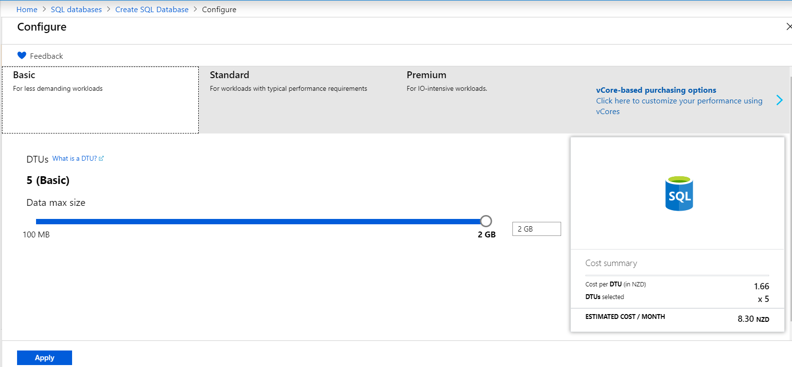
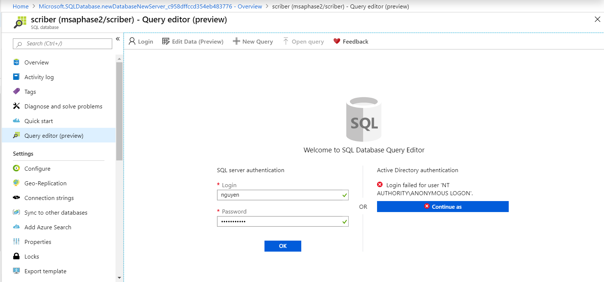
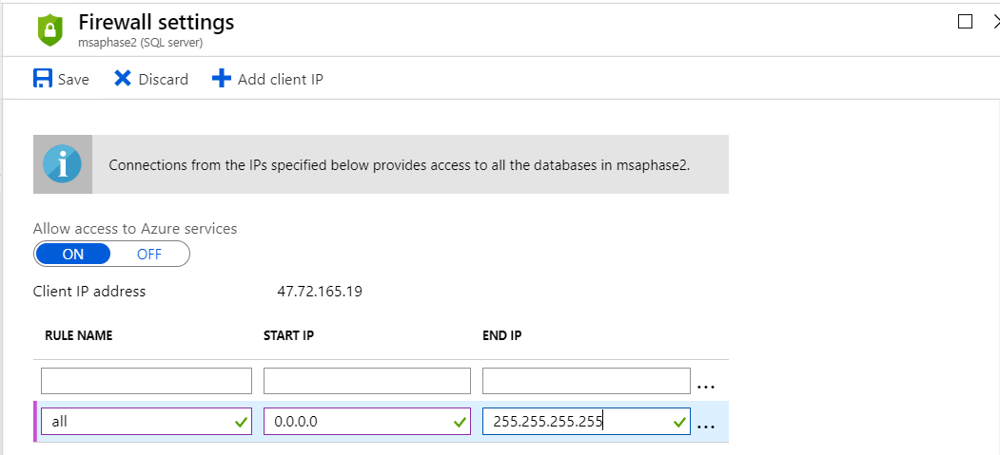
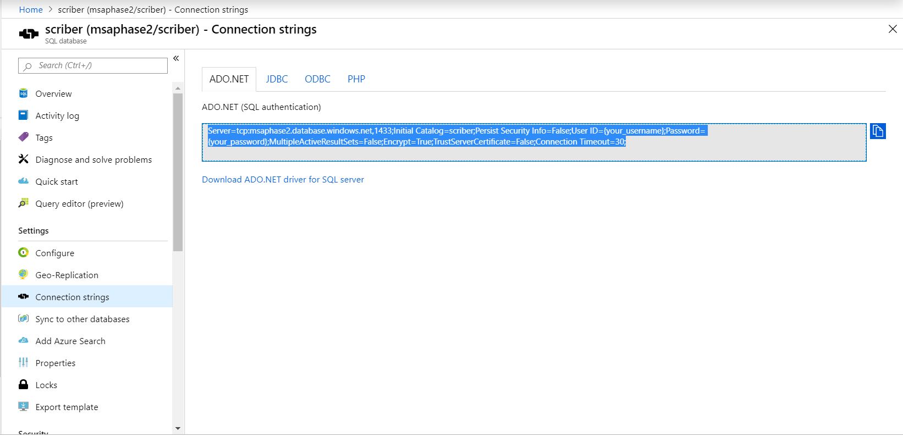

# 1. Setup

If you did not choose Databases and API for your project in phase 1, it will be very helpful for you to have a look at it before you start with this stream in phase 2.

* [GitHub tutorial](https://github.com/NZMSA/2019-Phase-1/tree/master/Databases%20%26%20API)
* [YouTube tutorial](https://youtu.be/U6SlmoXWf3o)

You will need to install `NET Core 2.2 SDK` for this tutorial.

* [NET Core 2.2 SDK](https://dotnet.microsoft.com/download/visual-studio-sdks)

# 2. Creating Database ERD

In this tutorial, we will have the user to input a/some keyword(s) to search and see if those keywords are included inside the Videos' transcriptions. Therefore, we will need a database to store Videos and Transcriptions.

First of all, let's think about what information about Videos that we'd want to store? The information should be:
* VideoId (Primary Key)
* VideoTitle
* VideoLength
* WebURL
* ThumbnailURL
* isFavourite

Next will be storing Transcriptions with the following information:
* TranscriptionId (Primary Key)
* VideoId (Foreign Key)
* StartTime (Time at which the searched keywords appear!)
* Phrase

Since one video can have many transcriptions but one transcription belongs to only one video. Therefore we will have a one-to-many relationship here between two tables: Video and Transcription. Let's look at the following ERD:



# 3. Creating Database on Azure

We have finished designing our database schema, now we will move to create it on Azure.

Navigate to https://portal.azure.com on your browser and login to your account. Go ahead and search for "SQL databases" on the searching toolbar.


Then click on Add then follow the steps as following:




When you are creating a new server, choose your server name and note down your database admin login and password. Choose Australia Southeast for Location as it is physically closest to us.


When it comes to choosing Compute + storage, select the free/cheapest option and click Apply!



When you are done, click on Review + create then your deployment should be underway!

In about 2 minutes, you should see the following notification. go ahead and click on `Go to resource`


From the toolbar on the left, choose Query Editor (preview) and put in your database admin login and password as you have just created and click OK!



We are now going to use SQL statement to create a new table named Video

```sql
CREATE TABLE dbo.Video
(
    VideoId INT NOT NULL IDENTITY(1,1) PRIMARY KEY, -- primary key column
    VideoTitle VARCHAR(255) NOT NULL,
    VideoLength INT NOT NULL,
    WebURL VARCHAR(255) NOT NULL,
    ThumbnailURL VARCHAR(255) NOT NULL,
    isFavourite Bit NOT NULL
);
```

Hit the Run button then you should see a message saying `Query succeeded`


Repeat the step to create the Transcription table with the following SQL command:

```sql
CREATE TABLE dbo.Transcription
(
    TranscriptionId INT NOT NULL IDENTITY(1,1) PRIMARY KEY,
    VideoId INT,
    StartTime Int NOT NULL,
    Phrase VARCHAR(255) NOT NULL

    CONSTRAINT [VideoId] FOREIGN KEY (VideoId) REFERENCES [dbo].[Video] (VideoId) ON DELETE CASCADE
);
```

We have just finished creating database based on the database schema. We now need to do two more things to allow us to access the database from anywhere.

Go back to Overview and hit "Set server firewall" and add the following firewall rule to enable access to the database from any IP address and hit Save.



Choose `Connection Strings` from the toolbar and copy `ADO.NET` connection string, we will need to use this to scaffold the database in the next step.



Now we are good to go to the next part - Scaffolding!
