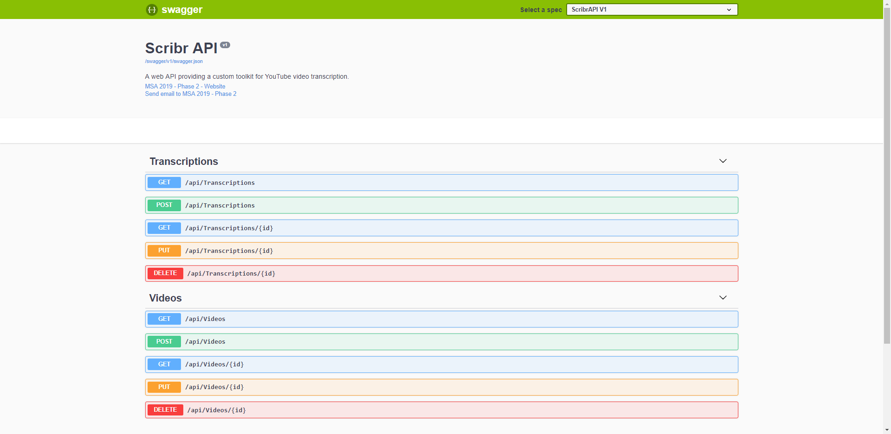
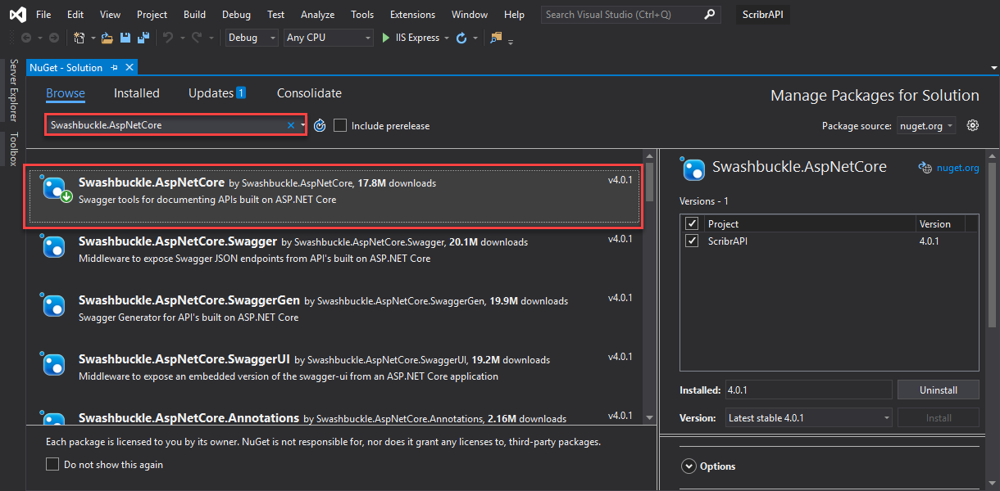

# Swagger UI - Visual documentation for your API

## Introduction

The Swagger UI is an open source project to visually render documentation for your API. It lets you easily visualize and interact with the API you just created. This tutorial will be guiding you through the process of adding swagger UI to your project. Let's take the API documentation to the next level! 

Read More / Live Demo Example: [Swagger UI](https://swagger.io/tools/swagger-ui/)



Adding `Swashbuckle.AspNetCore` package. With your project opened, right click your solution and choose 'Manage NuGet Packages for Solution'. Search and install `Swashbuckle.AspNetCore`.



In `Startup.cs` add the following:

- To the top of the file add the directive to include the package's namespace.

```C#
using Swashbuckle.AspNetCore.Swagger;
````

- Under `ConfigureServices(IServiceCollection services)` method, add

```C#
  // Register the Swagger generator, defining 1 or more Swagger documents
  services.AddSwaggerGen(c =>
  {
      c.SwaggerDoc("v1", new Info { Title = "TITLE", Version = "v1" });
  });
```
Or you can provide more detail by passing in the `info` object like the example below, giving your swagger UI document more information.

```C#
        // This method gets called by the runtime. Use this method to add services to the container.
        public void ConfigureServices(IServiceCollection services)
        {
            services.AddMvc().SetCompatibilityVersion(CompatibilityVersion.Version_2_2);

            // Register the Swagger generator, defining 1 or more Swagger documents
            services.AddSwaggerGen(c =>
            {
                c.SwaggerDoc("v1", new Info
                {
                    Title = "Scribr API",
                    Version = "v1",
                    Description = "A web API providing a custom toolkit for YouTube video transcription.",
                    Contact = new Contact
                    {
                        Name = "MSA 2019 - Phase 2",
                        Email = "nzmsa@microsoft.com",
                        Url = "https://github.com/NZMSA/2018-Phase-2"
                    },
                });
            });
        }

```

- Add the following to the `public void Configure(IApplicationBuilder app, IHostingEnvironment env)`.

```C#
public void Configure(IApplicationBuilder app, IHostingEnvironment env)
        {
            // Enable middleware to serve generated Swagger as a JSON endpoint.
            app.UseSwagger();

            // Enable middleware to serve swagger-ui (HTML, JS, CSS, etc.), 
            // specifying the Swagger JSON endpoint.
            app.UseSwaggerUI(c =>
            {
                c.SwaggerEndpoint("/swagger/v1/swagger.json", "ScribrAPI V1");
                c.RoutePrefix = string.Empty; // launch swagger from root
            });

            if (env.IsDevelopment())
            {
                app.UseDeveloperExceptionPage();
            }
            else
            {
                // The default HSTS value is 30 days. You may want to change this for production scenarios, see https://aka.ms/aspnetcore-hsts.
                app.UseHsts();
            }

            app.UseHttpsRedirection();
            app.UseMvc();
        }

```

<details>
  <summary>Example</summary>

Your Startup.cs may look **similar** to this.

 ```C#

using System;
using System.Collections.Generic;
using System.Linq;
using System.Threading.Tasks;
using Microsoft.AspNetCore.Builder;
using Microsoft.AspNetCore.Hosting;
using Microsoft.AspNetCore.HttpsPolicy;
using Microsoft.AspNetCore.Mvc;
using Microsoft.Extensions.Configuration;
using Microsoft.Extensions.DependencyInjection;
using Microsoft.Extensions.Logging;
using Microsoft.Extensions.Options;
using Swashbuckle.AspNetCore.Swagger;

namespace ScribrAPI
{
    public class Startup
    {
        public Startup(IConfiguration configuration)
        {
            Configuration = configuration;
        }

        public IConfiguration Configuration { get; }

        // This method gets called by the runtime. Use this method to add services to the container.
        public void ConfigureServices(IServiceCollection services)
        {
            services.AddMvc().SetCompatibilityVersion(CompatibilityVersion.Version_2_2);

            // Register the Swagger generator, defining 1 or more Swagger documents
            services.AddSwaggerGen(c =>
            {
                c.SwaggerDoc("v1", new Info
                {
                    Title = "Scribr API",
                    Version = "v1",
                    Description = "A web API providing a custom toolkit for YouTube video transcription.",
                    Contact = new Contact
                    {
                        Name = "MSA 2019 - Phase 2",
                        Email = "nzmsa@microsoft.com",
                        Url = "https://github.com/NZMSA/2018-Phase-2"
                    },
                });
            });
        }

        // This method gets called by the runtime. Use this method to configure the HTTP request pipeline.
        public void Configure(IApplicationBuilder app, IHostingEnvironment env)
        {
            // Enable middleware to serve generated Swagger as a JSON endpoint.
            app.UseSwagger();

            // Enable middleware to serve swagger-ui (HTML, JS, CSS, etc.), 
            // specifying the Swagger JSON endpoint.
            app.UseSwaggerUI(c =>
            {
                c.SwaggerEndpoint("/swagger/v1/swagger.json", "ScribrAPI V1");
                c.RoutePrefix = string.Empty; // launch swagger from root
            });

            if (env.IsDevelopment())
            {
                app.UseDeveloperExceptionPage();
            }
            else
            {
                // The default HSTS value is 30 days. You may want to change this for production scenarios, see https://aka.ms/aspnetcore-hsts.
                app.UseHsts();
            }

            app.UseHttpsRedirection();
            app.UseMvc();
        }
    }
}

 ```

</details>


Finally, under `Properties` tab - in `launchSettings.json`  changes all the 

```C#
    "launchUrl": "api/values",
```

to

```C#
    "launchUrl": "",
```

So when we launch the website we should see Swagger UI. 

<details>
  <summary>Example</summary>

Your launchSettings.json may look **similar** to this.

 ```C#

{
  "$schema": "http://json.schemastore.org/launchsettings.json",
  "iisSettings": {
    "windowsAuthentication": false, 
    "anonymousAuthentication": true, 
    "iisExpress": {
      "applicationUrl": "http://localhost:51659",
      "sslPort": 44303
    }
  },
  "profiles": {
    "IIS Express": {
      "commandName": "IISExpress",
      "launchBrowser": true,
      "launchUrl": "",
      "environmentVariables": {
        "ASPNETCORE_ENVIRONMENT": "Development"
      }
    },
    "ScribrAPI": {
      "commandName": "Project",
      "launchBrowser": true,
      "launchUrl": "",
      "applicationUrl": "https://localhost:5001;http://localhost:5000",
      "environmentVariables": {
        "ASPNETCORE_ENVIRONMENT": "Development"
      }
    }
  }
}
 ```

</details>

### Go ahead and run the application to see your new Swagger UI in action!

## Using Swagger UI

Swagger UI enables you to interact with your API directly. 

Now, you should see the following when you run the application. Swagger UI renders all the basic methods needed to interact with your data model making it easy to test your API. 


If you click on `[GET] /api/Videos` -> Execute, it would return all the video information from the Videos table you created. But we are not there yet, something to look forward to in the next part!

You should get a `Sever response Code 200.` Check out the example below, the end result when the database has been populated.


This is essentially the same as navigating to your URL with `/api/Videos` e.g. `https://localhost:44303/api/Videos` or invoking a GET request using [Postman](https://www.getpostman.com/downloads/) tool. But this is much nicer!

Keep exploring to find out what Swagger UI can do for you!


