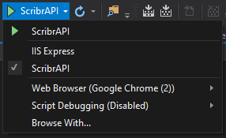
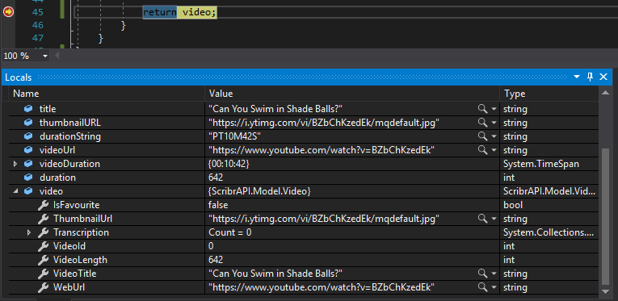
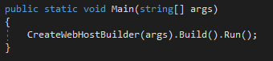
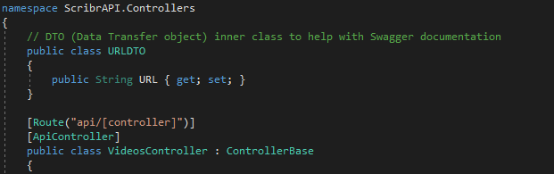
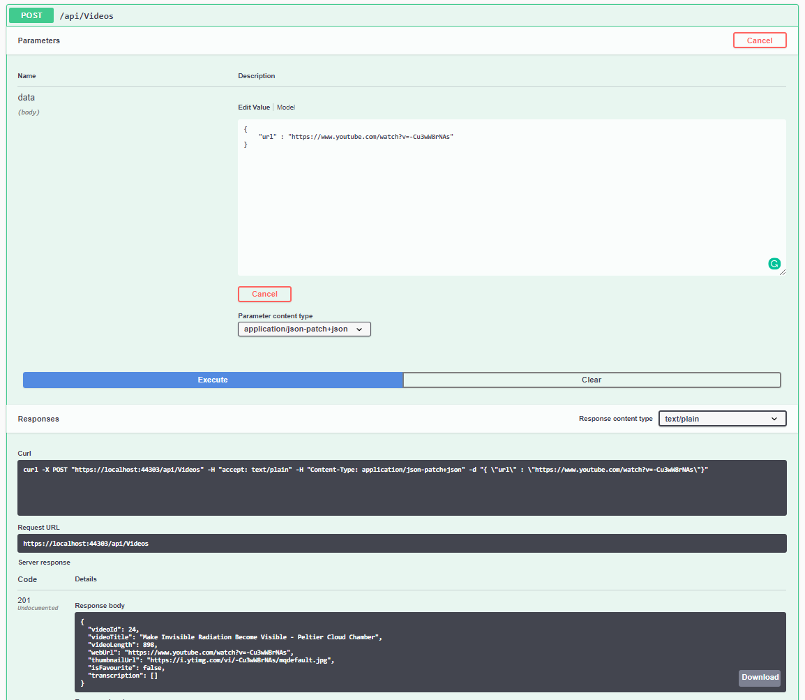

YouTube provides an official API for getting information on a YouTube video. This is known as the `YouTube Data API V3`. Our first goal to create a program that retrieves video information from this API and store it in our database.

The information we need to get from the API are
* Title
* Thumbnail
* Video length
* Video URL 

To start using the YouTube API, take a look at this link
https://developers.google.com/youtube/v3/getting-started

We will need to create a project on Google's Developer console: https://console.developers.google.com/

On the search bar on the top, search for YouTube Data API V3, then choose add credentials to your project.

Again, choose YouTube Data API V3, We will be calling the API from "Other UI" and we will be accessing public data.

After you've done that, you should have an API key, this API key allows us to make the API request to YouTube.

If you've read the documentation on the YouTube API, you would find that the following link would give us what we need to store in the database.

https://www.googleapis.com/youtube/v3/videos?id=`VIDEOIDHERE`&key=`APIKEYHERE`&part=snippet,contentDetails

The API returns a JSON format string which we can manipulate easily in ASP.NET to extract information.

In order to use this API in ASP.NET, we need to create a so-called helper class, the purpose of this helper class is to deal with all YouTube API retrieving/crawling. The purpose of creating this class is to reduce code duplication and make sure that one class only has one responsibility. Create a new folder in the project called Helper and add a new class under that folder, we will call it `YouTubeHelper`, paste in the following code, the code doesn't do much right now but we will make progress shortly :)

```C#
using System;
using System.Collections.Generic;
using System.Linq;
using System.Threading.Tasks;
using ScribrAPI.Model;

namespace ScribrAPI.Helper
{
    public class YouTubeHelper
    {
        public static void testProgram(){
            Console.WriteLine(GetVideoIdFromURL("https://www.youtube.com/watch?v=ehvz3iN8pp4"));

            // Pause the program execution
            Console.ReadLine();
        }

        public static void GetVideoIdFromURL(String videoURL)
        {
            // TODO - Extract the video id from the video link.
            return videoURL;
        }
    }
}
```

Now we need to go to the entry point in the program and call that test function. Navigate to `Program.cs` as under the method `Main()` and perform the following edit. We will change this back later.

```C#
public static void Main(string[] args)
{
    Helper.YouTubeHelper.testProgram();
    // CreateWebHostBuilder(args).Build().Run();
}
``` 

Now we can test this program by changing the launch option from IIS Express to ScribrAPI as we won't need to launch a browser to test this class.



If everything goes well, the string "https://www.youtube.com/watch?v=ehvz3iN8pp4" will be printed in the console. Now we are ready to code some login into our crawler.

# Extract video ID from video link
Our first goal is to extract the unique video ID from the link.
For example, The video ID of https://www.youtube.com/watch?v=ehvz3iN8pp4 would be ehvz3iN8pp4, and the video ID of https://www.youtube.com/watch?v=YQZ2UeOTO3I would be YQZ2UeOTO3I. Seeing a pattern here? The video ID is always after the equal sign in a standard YouTube link. In this tutorial, we will not consider the shortened link such as `https://youtu.be/YQZ2UeOTO3I` or additional parameters such as https://www.youtube.com/watch?v=YQZ2UeOTO3I`&t=10`, this is an easy task left as an exercise for you.

 So, in order to extract the video ID, the `=` sign is the key. A simple way of doing so would be to find the location of the `=` sign in the string and add one to it, that would make sure that it is the beginning of the video ID.

 ```C#
 int indexOfFirstId = videoURL.IndexOf("=") + 1;
 ```

 Then, we can use the `Substring()` in the string object to extract a substring.
 ```C#
 String videoId = videoURL.Substring(indexOfFirstId);
 return videoId;
 ```

Your function should look like this.


Test your function with your `testProgram()`, you should know how to test it at this point.

# Call YouTube Data V3 API to get video information 
Our next step is to use this video ID to call the YouTube Data V3 API from our API.

Install `Newtonsoft.Json` from NuGet manager, we will be using this to deal with the content that the YouTube API returns.

Create a `public static` method called `GetVideoInfo(String videoId)` that returns a `Video` object, the purpose of this method is to return a Video object that the API can use to create an entry in the database.

We will first fetch the JSON into our application. Add the following code in the `GetVideoInfo(String videoId)`

```C#
String APIKey = "YOURAPIKEY";
String YouTubeAPIURL = "https://www.googleapis.com/youtube/v3/videos?id=" + videoId + "&key=" + APIKey + "&part=snippet,contentDetails";

// Use an http client to grab the JSON string from the web.
String videoInfoJSON = new WebClient().DownloadString(APIurl);

// Using dynamic object helps us to more efficiently extract information from a large JSON String.
dynamic jsonObj = JsonConvert.DeserializeObject<dynamic>(videoInfoJSON);
```

The videoInfoJSON String has been parsed into a dynamic object which would allow us to manipulate the information easily. Next we will extract the necessary information from the jsonObj. To understand why it's constructed that way it is below, we need to take a look at the JSON that YouTube API returns. 

```C#
// Extract information from the dynamic object.
String title = jsonObj["items"][0]["snippet"]["title"];
String thumbnailURL = jsonObj["items"][0]["snippet"]["thumbnails"]["medium"]["url"];
String durationString = jsonObj["items"][0]["contentDetails"]["duration"];
String videoUrl = "https://www.youtube.com/watch?v=" + videoId;

// duration is given in this format: PT4M17S, we need to use a simple parser to get the duration in seconds.
TimeSpan videoDuration = XmlConvert.ToTimeSpan(durationString);
int duration = (int) videoDuration.TotalSeconds;
```

Now that we have everything we need, we can now create a Video object from our model.
```C#
// Create a new Video Object from the model defined in the API.
Video video = new Video
{
    VideoTitle = title,
    WebUrl = videoUrl,
    VideoLength = duration,
    IsFavourite = false,
    ThumbnailUrl = thumbnailURL
};
return video;
```

Note that this method returns a video object, so we need to change the method signature to tell the compiler that we are returning an video object. Change `public static void GetVideoInfo(String videoId)` to `public static Video GetVideoInfo(String videoId)`

Now that the method is done, we can test this by calling this method in `testProgram()`
```C#
public static void testProgram() {
    GetVideoInfo("BZbChKzedEk");
}
```

Set a breakpoint in the last line of the method so we can take a look at the video object we've constructed, we can do this by clicking on the empty space on the left until the red dot shown below appears.


If we run the program now, we can see that the video object contains the information we need.


We are done with constructing the Video object! We are now ready to incorporate this little helper function into our API.

# Insert the video object into our database
We want to use the `YouTubeHelper` whenever we receive a POST request in the `/Video` endpoint.

Before we do that, we need to go back to the API project. Remove the call to YouTubeHelper and uncomment `CreateWebHostBuilder()` in `Program.cs`, so that the API launches again normally.



We now need to modify the VideoController, navigate to the method that handles POST request in VideoController. Instead of receiving a whole video object from the request body, we will edit this method so that it takes an YouTube URL.

In order to process a POST request, we first need to obtain the request body so we know what information to process. Modify the signature of the `PostVideo()` to the following.

```c#
public async Task<ActionResult<Video>> PostVideo([FromBody]URLDTO data)
```

You will notice that there is an error, that's because we don't have URLDTO class, we will create this class as an inner class now in VideosController.



Why do we do this? This is because the we could get the information from the request body, we could use dynamic object as before, but, using a concrete class would allow Swagger to document the API better, you will see what I mean soon. 
For now, go back to `PostVideo()` and add in the following code.

```C#
// POST: api/Videos
[HttpPost]
public async Task<ActionResult<Video>> PostVideo([FromBody]URLDTO data)
{
    Video video;
    try
    {
        // Constructing the video object from our helper function
        videoURL = data.URL;
        videoId = YouTubeHelper.GetVideoIdFromURL(videoURL);
        video = YouTubeHelper.GetVideoInfo(videoId);
    } catch {
        return BadRequest("Invalid YouTube URL");
    }

    // Add this video object to the database
    _context.Video.Add(video);
    await _context.SaveChangesAsync();

    // Return success code and the info on the video object
    return CreatedAtAction("GetVideo", new { id = video.VideoId }, video);
}
```
If we launch the application now and pass the following JSON in the request body
```JSON
{
    "URL" : "https://www.youtube.com/watch?v=-Cu3wW8rNAs"
}
```

We would receive a response with the video info.


And if you make a GET request to /Videos in Swagger UI, you would see your newly added video.

# Add transcriptions to the corresponding video 
Now that we have video information in our database, we will need to store the transcriptions in our database. The approach we will be taking is to store every phrase in the transcription in our Transcription database. This probably is the most difficult and the most interesting part of the API. :)

> WARNING: This part of the program uses an undocumented API of the YouTube website, which is done by emulating a user visiting YouTube and crawl around the source code. So there is no guarantee that it won't stop working tomorrow.

Where do we go when we are trying to get information from YouTube? You guessed it, `YouTubeHelper.cs`. We will need to create a new private method called GetTranscriptionLink which takes a videoId as parameter and returns a string, the link of the YouTube transcription.

Your method signature should be similar to this
```C#
private static String GetTranscriptionLink(String videoId)
```

The logic of the method would be: visiting the YouTube Video on a web client, download the source code, attempt to find the transcription link from the source code, and return that link.

Our first step would be to get the source code of the YouTube video link.

```C#
String YouTubeVideoURL = "https://www.youtube.com/watch?v=" + videoId;
// Use a WebClient to download the source code.
String HTMLSource = new WebClient().DownloadString(YouTubeVideoURL);
```

Then, from the source code, we need to find something that looks like

```
https:\/\/www.youtube.com\/api\/timedtext?asr_langs=en%2Cru%2Cko%2Cde%2Cja%2Cit%2Cpt%2Cfr%2Ces%2Cnl\\u0026hl=en\\u0026signature=D7A977E16056239A6C8B1AA57674FE6A558D4903.7CA81B4A709C12AFF93C5806EADE885F75142DE4\\u0026expire=1562049392\\u0026xoaf=1\\u0026xorp=True\\u0026key=yttt1\\u0026caps=asr\\u0026v=hLvddwpu_PI\\u0026sparams=asr_langs%2Ccaps%2Cv%2Cxoaf%2Cxorp%2Cexpire\\u0026kind=asr\\u0026lang=en\
```

Here is another one

```
https:\/\/www.youtube.com\/api\/timedtext?v=MiCftTLUzCI\\u0026expire=1562049563\\u0026asr_langs=fr%2Cpt%2Cnl%2Ces%2Cit%2Cde%2Cen%2Cja%2Cru%2Cko\\u0026caps=asr\\u0026sparams=asr_langs%2Ccaps%2Cv%2Cexpire\\u0026signature=94D9E4A8854CA3328A6893F03412778B67661DC0.9AFB5F65EDBA743A9379666A8E09F250607622F4\\u0026key=yttt1\\u0026hl=en\\u0026lang=en
```

This may look very cryptic now, there are some *escape* characters and *HTML characters* we need to deal with, we will worry about them later, ignore that for now, can you find any pattern between the two strings?

> Observation:
They both begin with `https:\/\/www.youtube.com\/api\/timedtext?` and end with `lang=en`, if you look at the source code of the video link, there are no other link that looks like this, we can use this pattern to uniquely identify the transcription link.

## Regular Expression
We need to use a tool called Regular Expression, aka RegEx, to find this pattern, add the following code into your method.
```C#
String pattern = "timedtext.+?lang=";
Match match = Regex.Match(HTMLSource, pattern);
```

The magic lies in the string `pattern`

```
timedtext.+?lang=
```

| Symbol   |      Meaning      |
|----------|--------------|
| timedtext|  String literal, used to match exactly this string |
| .        |  Any character   |
| +        | Match one or more character proceeding this symbol, in this case, it               is '.', which is any character  |
| ?        |  Once or none, in this case, we are find the last occurrence of this                pattern  |
| lang=    |  String literal, used to match exactly this string |

To translate string into English: Get me the last string that starts with `timedtext` and end with `lang=`, capturing any characters in between the two strings.

For example, given this String:
```
https:\/\/www.youtube.com\/api\/timedtext?asr_langs=en%2Cru%2Cko%2Cde%2Cja%2Cit%2Cpt%2Cfr%2Ces%2Cnl\\u0026hl=en\\u0026signature=D7A977E16056239A6C8B1AA57674FE6A558D4903.7CA81B4A709C12AFF93C5806EADE885F75142DE4\\u0026expire=1562049392\\u0026xoaf=1\\u0026xorp=True\\u0026key=yttt1\\u0026caps=asr\\u0026v=hLvddwpu_PI\\u0026sparams=asr_langs%2Ccaps%2Cv%2Cxoaf%2Cxorp%2Cexpire\\u0026kind=asr\\u0026lang=en\
```

It would match

```
timedtext?asr_langs=en%2Cru%2Cko%2Cde%2Cja%2Cit%2Cpt%2Cfr%2Ces%2Cnl\\u0026hl=en\\u0026signature=D7A977E16056239A6C8B1AA57674FE6A558D4903.7CA81B4A709C12AFF93C5806EADE885F75142DE4\\u0026expire=1562049392\\u0026xoaf=1\\u0026xorp=True\\u0026key=yttt1\\u0026caps=asr\\u0026v=hLvddwpu_PI\\u0026sparams=asr_langs%2Ccaps%2Cv%2Cxoaf%2Cxorp%2Cexpire\\u0026kind=asr\\u0026lang=
```

Given that the proceeding and ending strings are constants, we can simply add it into the program.
```C#
String subtitleLink = "https://www.youtube.com/api/" + match + "en";
return subtitleLink;
```

What happens if the transcriptions can't be found? The link wouldn't make sense, so let's add in a check, we will return null if the string cannot be found.

```C#
if (match.ToString() != "")
{
    String subtitleLink = "https://www.youtube.com/api/" + match + "en";
    subtitleLink = CleanLink(subtitleLink);
    return subtitleLink;
}
else
{
    return null;
}
```

We are almost done, we now need to address escape character and HTML characters, since this is a different responsibility, let's put this into a different private function called `CleanLink()` and let our `GetTranscriptionLink()` to call this method.

Here is what characters mean:


| String   |      Character      |
|----------|--------------|
| \\\\u0026|  "&" |
| \\\\       |  "" (Nothing)   |


Here is the code for replacing the String with the corresponding characters, this is self-explanatory.
```C#
private static String CleanLink(String subtitleURL)
{
    subtitleURL = subtitleURL.Replace("\\\\u0026", "&");
    subtitleURL = subtitleURL.Replace("\\", "");
    return (subtitleURL);
}
```

Your final `GetTranscriptionLink()` after adding in `CleanLink()` should look like this:
```C#
private static String GetTranscriptionLink(String videoId)
{
    String YouTubeVideoURL = "https://www.youtube.com/watch?v=" + videoId;
    // Use a WebClient to download the source code.
    String HTMLSource = new WebClient().DownloadString(YouTubeVideoURL);

    // Use regular expression to find the link with the transcription
    String pattern = "timedtext.+?lang=";
    Match match = Regex.Match(HTMLSource, pattern);
    if (match.ToString() != "")
    {
        String subtitleLink = "https://www.youtube.com/api/" + match + "en";
        subtitleLink = CleanLink(subtitleLink);
        return subtitleLink;
    }
    else
    {
        return null;
    }
}
```

Now we are finally ready to make a list of transcriptions, create a new public method called `GetTranscriptions(String videoId)`.

```C#
public static List<Transcription> GetTranscriptions(String videoId)
    {
        String subtitleLink = GetTranscriptionLink(videoId);

        // Use XmlDocument to load the subtitle XML.
        XmlDocument doc = new XmlDocument();
        doc.Load(subtitleLink);
        XmlNode root = doc.ChildNodes[1];

        // Go through each tag and look for start time and phrase.
        List<Transcription> transcriptions = new List<Transcription>();
        if (root.HasChildNodes)
        {
            for (int i = 0; i < root.ChildNodes.Count; i++)
            {
                // Decode HTTP characters to text
                // e.g. &#39; -> '
                String phrase = root.ChildNodes[i].InnerText;
                phrase = HttpUtility.HtmlDecode(phrase);

                Transcription transcription = new Transcription
                {
                    StartTime = (int)Convert.ToDouble(root.ChildNodes[i].Attributes["start"].Value),
                    Phrase = phrase
                };

                transcriptions.Add(transcription);
            }
        }
        return transcriptions;
    }
```

In this code, we load the XML source code up, add each phrase and start time the the list of Transcription objects and return. We would be able to use this method in `VideosController` whenever we receive a video request.

Now that `YouTubeHelper` class has everything needed to get a list of transcriptions, it is time for us to incorporate this into our `VideosController`.

We will do our modification on `PostVideo()` as we want to add transcriptions into our database when we receive a new video request.

```C#
// POST: api/Videos
[HttpPost]
public async Task<ActionResult<Video>> PostVideo([FromBody]URLDTO data)
{
    Video video;
    try
    {
        // Constructing the video object from our helper function
        videoURL = data.URL;
        videoId = YouTubeHelper.GetVideoIdFromURL(videoURL);
        video = YouTubeHelper.GetVideoInfo(videoId);
    } catch {
        return BadRequest("Invalid YouTube URL");
    }

    // Add this video object to the database
    _context.Video.Add(video);
    await _context.SaveChangesAsync();

    // Get the primary key, id of the video, note this is not the video ID on YouTube
    int id = video.VideoId;

    // This is needed because context are NOT thread safe, therefore we create another context for the following task.
    // We will be using this to insert transcriptions into the database on a separate thread
    // So that it doesn't block the API.
    scriberContext tempContext = new scriberContext();
    TranscriptionsController transcriptionsController = new TranscriptionsController(tempContext);

    // Return success code and the info on the video object
    return CreatedAtAction("GetVideo", new { id = video.VideoId }, video);
}
```

Below the `_context.SaveChangesAsync()`, we will call our new methods in YouTubeHelper. Before we do any actual coding, let's consider a problem:

> What could happen if there are thousands of phrases to be stored in the database? We would need to process the phrases one by one, what problem could this present?

If we do add the phrases one by one in the main program, waiting for all the phrases to be added in the database will inevitably take a very long time. What does this mean? Consider the arrival of a second API call while we are processing the transcriptions. Since our main program is busy, the second API call would have no choice but to wait until all the transcriptions are saved into the database. The code is *blocking* other API calls. 

This is why we need to use multi-threading, the goal of using `System.Threading` is to delegate time consuming task to another thread so that the main thread is not blocked. .NET provides a very simple class that deals with simple multithreading, `Task` class under the namespace `System.Threading.Tasks`. Add the following code after `_context.SaveChangesAsync()` but before `return CreatedAtAction("GetVideo", new { id = video.VideoId }, video)`

```C#
// Get the primary key of the newly created video record
int id = video.VideoId;

// This is needed because context are NOT thread safe, therefore we create another context for the following task.
// We will be using this to insert transcriptions into the database on a separate thread
// So that it doesn't block the API.
scriberContext tempContext = new scriberContext();
TranscriptionsController transcriptionsController = new TranscriptionsController(tempContext);

// This will be executed in the background.
Task addCaptions = Task.Run(async () =>
{
    // Get a list of captions from YouTubeHelper
    List<Transcription> transcriptions = new List<Transcription>();
    transcriptions = YouTubeHelper.GetTranscriptions(videoId);

    for (int i = 0; i < transcriptions.Count; i++)
    {
        // Get the transcription objects form transcriptions and assign VideoId to id, the primary key of the newly inserted video
        Transcription transcription = transcriptions.ElementAt(i);
        transcription.VideoId = id;
        // Add this transcription to the database
        await transcriptionsController.PostTranscription(transcription);
    }
});
```

Now if we test the code on Swagger, by providing a YouTube link via POST /Videos, the transcriptions should be added in a non-blocking way in the background, to see this, make a Get /Transcriptions and confirm that transcriptions are being added.

This module could be very time consuming and error prone, if you are experiencing any problems, try to see if you can debug yourself, consult Google/Stack Overflow if need be, if you are still stuck, you more than welcome to make a post <del>request</del> on facebook, I am sure MSPs and other students will be able to help. 