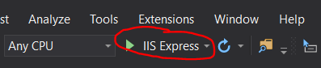
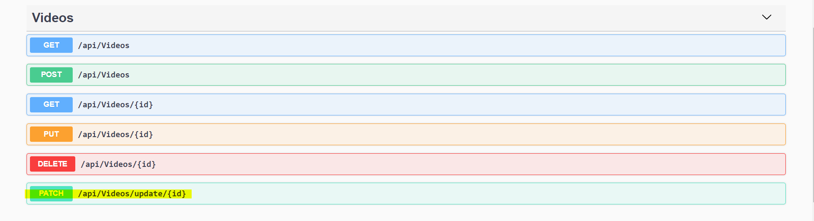
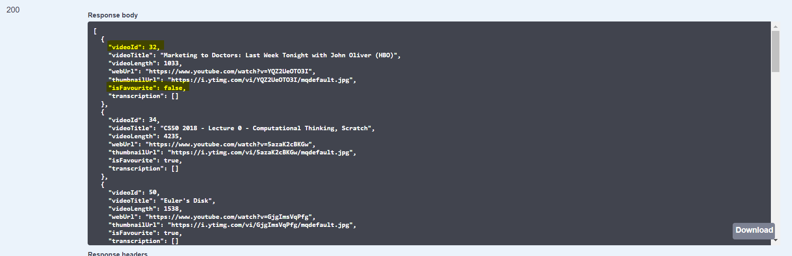
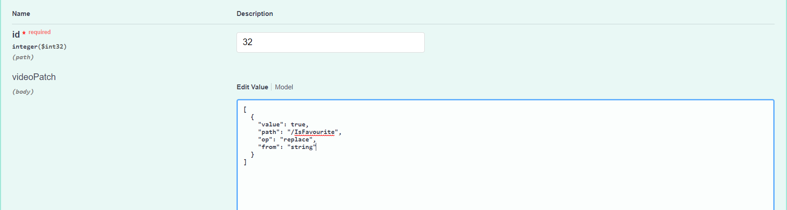
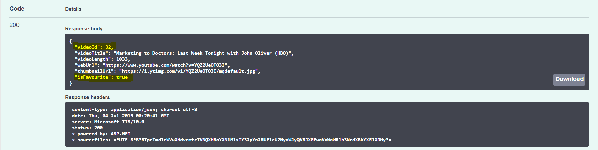

# PATCH Request

***Why JSON PATCH???***

`JSONPatch` is a method to update documents partially on an API, in which the value to be changed is described exactly how we want to modify a document, i.e. we can change a value/ a field of the document without having to send along the rest of the unchanged values. In short, it’s lightweight because it only sends exactly what needs to be changed on the object.

`Patch` requests follow a structure of “operations” within an array which has 3 properties:

* “op” – Defines the operation you want to do. For example add, replace, test etc. In this project, we will only focus on Replace operation to update the `IsFavourite` attribute of the given videos.
* “path” – The “path” of the property on the object you want to edit.
* “value” – For the most part, defines the value we want to use within our operation.

See more examples [here](https://dotnetcoretutorials.com/2017/11/29/json-patch-asp-net-core/) for your understanding!

## 1. Setup

From the `Package Manager Console`, run the following commands to install the AutoMapper and the official JSON Patch library:

`Install-Package AutoMapper.Extensions.Microsoft.DependencyInjection`   
`Install-Package Microsoft.AspNetCore.JsonPatch`

## 2.Data Access Layer (DAL)

***The Repository***    
The repository is intended to create an abstraction layer between the data access layer (DAL) and the business logic layer of an application. Implementing these patterns can help insulate your application from changes in the data store and can facilitate automated unit testing or test-driven development (TDD). (source: [Microsoft](https://docs.microsoft.com/en-us/aspnet/mvc/overview/older-versions/getting-started-with-ef-5-using-mvc-4/implementing-the-repository-and-unit-of-work-patterns-in-an-asp-net-mvc-application?fbclid=IwAR0339QgLfYu2DuxWmkjsI0y1oxcyaDdZknQvQtP11SMbu_XZjOU5IXNcVI))

The following illustration shows the differences when the controller and context classes use the repository


You can refer to this [link](https://docs.microsoft.com/en-us/aspnet/mvc/overview/older-versions/getting-started-with-ef-5-using-mvc-4/implementing-the-repository-and-unit-of-work-patterns-in-an-asp-net-mvc-application?fbclid=IwAR0339QgLfYu2DuxWmkjsI0y1oxcyaDdZknQvQtP11SMbu_XZjOU5IXNcVI) to find out more about Repository and Unit of Work Patterns in an ASP.NET MVC Application

There are different ways to implement the repository. The approach to implementing an abstraction layer shown in this step is one of the options.

### Creating The Video Repository Class

Now we will create a folder called DAL and in the DAL folder, create a class file named `IVideoRepository.cs` with the following code:

```csharp
using System;
using System.Collections.Generic;
using ScribrAPI.Model;

namespace ScribrAPI.DAL
{
    public interface IVideoRepository : IDisposable
    {
        IEnumerable<Video> GetVideos();
        Video GetVideoByID(int VideoId);
        void InsertVideo(Video video);
        void DeleteVideo(int VideoId);
        void UpdateVideo(Video video);
        void Save();
    }
}
```

This code declares a typical set of CRUD methods (Create, Read, Update, and Delete), including two read methods:
* `GetVideos()` method returns all Video entities, and
* `GetVideoByID(int VideoId)` finds a single Video entity by ID.

In the DAL folder, create a class file named `VideoRepository.cs` file, which implements the IVideoRepository interface, with the following code:

```csharp
using System;
using System.Collections.Generic;
using System.Linq;
using System.Threading.Tasks;
using Microsoft.EntityFrameworkCore;
using ScribrAPI.Model;

namespace ScribrAPI.DAL
{
    public class VideoRepository : IVideoRepository, IDisposable
    {
        private scriberContext context;

        public VideoRepository(scriberContext context)
        {
            this.context = context;
        }

        public IEnumerable<Video> GetVideos()
        {
            return context.Video.ToList();
        }

        public Video GetVideoByID(int id)
        {
            return context.Video.Find(id);
        }

        public void InsertVideo(Video video)
        {
            context.Video.Add(video);
        }

        public void DeleteVideo(int videoId)
        {
            Video video = context.Video.Find(videoId);
            context.Video.Remove(video);
        }

        public void UpdateVideo(Video video)
        {
            context.Entry(video).State = EntityState.Modified;
        }

        public void Save()
        {
            context.SaveChanges();
        }

        private bool disposed = false;

        protected virtual void Dispose(bool disposing)
        {
            if (!this.disposed)
            {
                if (disposing)
                {
                    context.Dispose();
                }
            }
            this.disposed = true;
        }

        public void Dispose()
        {
            Dispose(true);
            GC.SuppressFinalize(this);
        }
    }
}
```

The database context is defined in a class variable, and the constructor expects a parameter of the context:

```csharp
private scriberContext context;

public VideoRepository(scriberContext context)
{
    this.context = context;
}
```
### Change the Videos Controller to Use the Repository

In VideosController.cs, add the following code - the Video Repository - as a IVideoRepository instance and call it in the constructor `VideosController(scriberContext context)`.

```csharp
using Microsoft.AspNetCore.Mvc;
using ScribrAPI.DAL;

//some existing code lines

public class VideosController : ControllerBase
    {
        private IVideoRepository videoRepository;

        public VideosController(scriberContext context)
            {
                _context = context;
                this.videoRepository = new VideoRepository(new scriberContext());
            }
```

## 3. Model
### Using Automapper In ASP.net Core
#### Creating VideoDTO

Our web API now exposes the database entities to the client. The client receives data from your database. However, sometimes you might want to change the data format that would be sent to the users.

To accomplish this, we will define a `data transfer object` (DTO). A `DTO` is an object that defines how the data will be sent over the network.

Inside `Video.cs` file, we will create a new VideoDTO class with the following code:

```csharp
[DataContract]
    public class VideoDTO
    {
        [DataMember]
        public int VideoId { get; set; }

        [DataMember]
        public string VideoTitle { get; set; }

        [DataMember]
        public int VideoLength { get; set; }

        [DataMember]
        public string WebUrl { get; set; }

        [DataMember]
        public string ThumbnailUrl { get; set; }

        [DataMember]
        public bool IsFavourite { get; set; }
    }
```

As a result, the `VideoDTO` class includes all of the properties from the Video model as above.

#### Adding AutoMapper Profile

Inside the Model folder, create a file named `MapperProfile.cs` with the following code. We will create two mappings, one from Video to VideoDTO , and the other one map VideoDTO to Video.

```csharp
using AutoMapper;

namespace ScribrAPI.Model
{
    public class MapperProfile: Profile
    {
        public MapperProfile()
        {
            CreateMap<Video, VideoDTO>();
            CreateMap<VideoDTO, Video>();
        }
    }
}
```
When your application runs, Automapper will go through your code looking for classes that inherit from “Profile” and will load their configuration.

#### Videos Controllers

Now we get to the main part that will create a PATCH request to handle partially updating a single property of Video.

Inside the `VideoController.cs` file, firstly we will add the mapper inside the constructor of VideosController as following:

```csharp
        private IVideoRepository videoRepository;
        private readonly IMapper _mapper;

        public VideosController(scriberContext context, IMapper mapper)
        {
            _context = context;
            _mapper = mapper;
            this.videoRepository = new VideoRepository(new scriberContext());
        }
```

 The we will continue to code our `PATCH` method:


```csharp
//PUT with PATCH to handle isFavourite
        [HttpPatch("update/{id}")]
        public VideoDTO Patch(int id, [FromBody]JsonPatchDocument<VideoDTO> videoPatch)
        {
            //get original video object from the database
            Video originVideo = videoRepository.GetVideoByID(id);
            //use automapper to map that to DTO object
            VideoDTO videoDTO = _mapper.Map<VideoDTO>(originVideo);
            //apply the patch to that DTO
            videoPatch.ApplyTo(videoDTO);
            //use automapper to map the DTO back ontop of the database object
            _mapper.Map(videoDTO, originVideo);
            //update video in the database
            _context.Update(originVideo);
            _context.SaveChanges();
            return videoDTO;
        }
```

#### Setup AutoMapper

Inside your ConfigureServices method of your `startup.cs`, add the following call as the AutoMapper required services as below:

`services.AddAutoMapper(typeof(Startup));`


```csharp
using AutoMapper;

// This method gets called by the runtime. Use this method to add services to the container.
        public void ConfigureServices(IServiceCollection services)
        {
            services.AddMvc().SetCompatibilityVersion(CompatibilityVersion.Version_2_2);
            services.AddDbContext<scriberContext>();
            services.AddAutoMapper(typeof(Startup));

//code continue
```

## 4. Testing PATCH Request
Now go ahead and launch your project with IIS Express in the tool bar.


Once it launches the project successfully, you will see the PATCH method under Videos section.



Go ahead and click on it to test it out.


As you can see in the Example Value, besides the Video ID, it will ask us four parameters to complete the request. Here we only focus on three of them: "value", "path", and "op". As introduced above:

* "value": defines the value we want to use within our operation.
* "path": The “path” of the property on the object you want to edit. In this case, if we wanted to edit “IsFavourite” the “path” property would look like “/IsFavourite"
* "op": Defines the “type” of operation you want to do. For example add, replace, test etc.

Now I will call a get request to see the list of videos that are in the database. Let say we want to change the IsFavourite value of the video with ID 32.



We will input into id, "value", "path", and "op" with 32, true, "/IsFavourite", "replace" respectively and hit Execute!



It will respond back with Code 200 and a Response Body that stated the Video with ID 32 has "IsFavourite" true.



Congratulation! Now we can update part of Video without having to send all attributes of Video entities. You can try to modify other attributes as well to see if our PATCH method is working well.

## 5. References:

* [Using Automapper In ASP.net Core](https://dotnetcoretutorials.com/2017/09/23/using-automapper-asp-net-core/)
* [Create Data Transfer Objects (DTOs)](https://docs.microsoft.com/en-us/aspnet/web-api/overview/data/using-web-api-with-entity-framework/part-5)
* [JSON Patch With ASP.net Core](https://dotnetcoretutorials.com/2017/11/29/json-patch-asp-net-core/)
* [Implementing the Repository and Unit of Work Patterns in an ASP.NET MVC Application (9 of 10)](https://docs.microsoft.com/en-us/aspnet/mvc/overview/older-versions/getting-started-with-ef-5-using-mvc-4/implementing-the-repository-and-unit-of-work-patterns-in-an-asp-net-mvc-application?fbclid=IwAR0339QgLfYu2DuxWmkjsI0y1oxcyaDdZknQvQtP11SMbu_XZjOU5IXNcVI)
