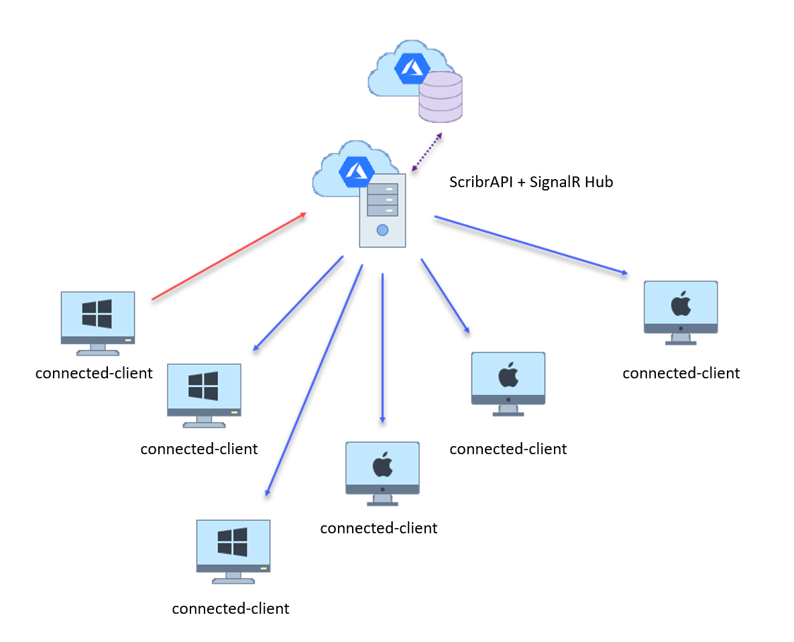
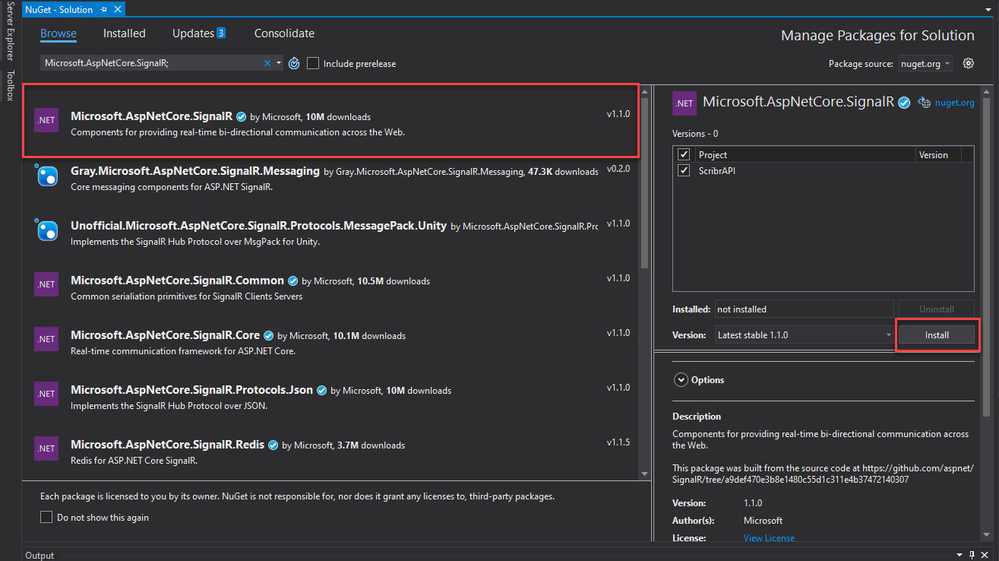
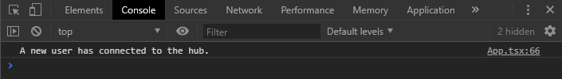

# SignalR: Enabling real-time capability in your web application. 


<p align="center">
    
    
</p>

## Introduction

ASP.NET Core SignalR is an open-source library that simplifies adding real-time web functionality to apps. Real-time web functionality enables server-side code to push content to connected-clients as it happens in real-time. Furthermore, SignalR integrates seemlessly with ASP.NET framework.

**Good candidates for SignalR:**

Apps that require high frequency updates from the server. 

- gaming
- social networks
- voting
- auction
- map
- chat
- alerts, many other apps use notifications.

<p align="center">
    
</p>

SignalR uses WebSocket which enables a bi-directional communication between the browser 
and server. 

📚 Reading: [Real-time ASP.NET with SignalR](https://dotnet.microsoft.com/apps/aspnet/real-time)

The SignalR library is made up of server-side and client-side JavaScript components.

We will implement a *hubs* in our backend ScribrAPI that allows a client (connected-client browser) and server to call methods on each other. Hubs call client-side code by sending messages that contain the name and parameters of the client-side method. The client tries to match the name to a method in the client-side code. When the client finds a match, it calls the method and passes to it the deserialized parameter data.

## Implementing a SignalR Hub

We will implement a CentralHub class in our ScribrAPI project to handle updating all the connected clients when something happens. We will start from the base complete API project. (You can find it under `2. API` folder)

Install `Microsoft.AspNetCore.SignalR;` in the solution NuGet Packages manager.

<p align="center">
    
</p>

Under your ScribrAPI project, add a new folder called ``CentralHub``, and add a new **C#** class file - ``SignalrHub.cs``. import the package by adding:

```C#
using Microsoft.AspNetCore.SignalR;
```

Then make your class inherit from the ``Hub`` class.

Add the following method.

```C#
        public async Task BroadcastMessage()
        {
            await Clients.All.SendAsync("Connected");
        }
```

<details>
  <summary><b>Your CentralHub.cs</b></summary>

```C#
using System;
using System.Collections.Generic;
using System.Linq;
using System.Threading.Tasks;
using Microsoft.AspNetCore.SignalR;

namespace ScribrAPI.CentralHub
{
    public class CentralHub : Hub
    {
        public async Task BroadcastMessage()
        {
            await Clients.All.SendAsync("Connected");
        }
    }
}
```  
</details>

This ``BroadcastMessage()`` method, when called by client, SignalR hub will invoke a JavaScript method name ``Connected`` defined in all currently connected clients browser.

In ``Startup.cs``

1. Under ``ConfigureServices()`` method add:

```C#
    //Registering Azure SignalR service
    services.AddSignalR();
```

2. At the top of ``Configure()`` method  add:

```c#
     // Make sure the CORS middleware is ahead of SignalR.
     app.UseCors(builder =>
     {
         builder.WithOrigins("http://localhost:3000")
             .AllowAnyHeader()
             .AllowAnyMethod()
             .AllowCredentials();
     });

     // SignalR
     app.UseFileServer();
     app.UseSignalR(routes =>
     {
         routes.MapHub<SignalrHub>("/hub");
     });
```
Above will add the rules to allow *CORS (Cross-Origin Resource Sharing)*, allowing web application running at one origin (domain) have permission to access selected resources from a server at a different origin. So you won't run into errors. 

Make sure to swap ``localhost:3000`` with your local front-end port or url of your website (When deployed). This will allows our front-end JavaScript to communicate with the SignalR hub in our backend.

## Implementing a client-side JavaScript.

Open up your front-end directory, and runs:

```C#
npm install @aspnet/signalr
```

To install a cliet-side SignalR package.

In ``App.tsx`` we will add **hubConnection** state to ``interface IState``:

```js
interface IState {
  hubConnection: any,
  updateVideoList: any,
  player: any,
  playingURL: string,
  videoList: object
}
```

and create a SingalR connection in the constructor.

```js
class App extends React.Component<{}, IState>{
  public signalR = require("@aspnet/signalr");
  public constructor(props: any) {
    super(props);
    this.state = {
      hubConnection: new this.signalR.HubConnectionBuilder().withUrl("https://localhost:44303/hub").build(),
      player: null,
      playingURL: "",
      updateVideoList: null,
      videoList: [],
    }
  }
...
```

Here we are creating a connection object to our backend up which was routed to ``[ScribrAPI]/hub`` endpoint in the ``Startup.cs`` (Previous step). Make sure you swap this url with your backend.

**Next,** create a ``componentDidMount`` method, which in React this gets called after the component is loaded. 

```js
  public componentDidMount = () => {

    this.state.hubConnection.on("Connected", ()  => {
      console.log('A new user has connected to the hub.');
    });

    this.state.hubConnection.start().then(() => this.state.hubConnection.invoke("BroadcastMessage"));
}
```

Here, we are defining a signalR client-side method *Connected*, which gets executed when the method of the same name in our backend signalR hub gets called. Look at ``BroadcastMessage()`` method in the backend ``SignalrHub.cs`` you will see that:  

```js
await Clients.All.SendAsync("Connected");
```

Will execute method declared with ``.on("Connected", () => {`` on all connected clients. 

Just after the ``Connected`` method in ``App.tsx`` add:

```js
this.state.hubConnection.start().then(() => this.state.hubConnection.invoke("BroadcastMessage"));
```

This is saying when the ``App.tsx`` component is mounted, starts a connection to the signalR hub, and then invoke ``BroadcastMessage()`` method in ``SignalrHub.cs`` (Which in turn execute ``.on("Connected", () => {`` on all clients.) Try launching both your frontend and backend, then open multiple browsers, you should now see a message in developer console *'A user has connected to the hub.'* everytime you open **another** new browser.

<p align="center">
    
</p>

## Making adding a video happens in real-time.

So, with the understanding of how SignalR works, we will apply the same mechanism to update all connected browsers **VideoList** component in real-time as soon as someone add a new video.

In ``SignalrHub.cs`` of our backend API, creates another signalr hub method ``AddVideo()`` which when called, execute ``UpdateVideoList`` method on the client-side.

```C#
    public async Task AddVideo()
    {
        await Clients.All.SendAsync("UpdateVideoList");
    }
```

In ``componentDidMount = () => {`` for ``App.tsx`` add another client-side signalR method.

```js
  public componentDidMount = () => {

    this.state.hubConnection.on("Connected", ()  => {
      console.log('A new user has connected to the hub.');
    });

    this.state.hubConnection.on("UpdateVideoList", ()  => {
        this.state.updateVideoList();
        console.log('A new video has been added!');
    });

    this.state.hubConnection.start().then(() => this.state.hubConnection.invoke("ConnectToHub"));
}
```

So we know that a video is added when ``addVideo`` method in ``App.tsx`` is invoked, so after a new video is added also invoke a hub method `VideoAdded`: 

```js
  public addVideo = (url: string) => {
    const body = {"url": url}
    fetch("https://localhost:44303/api/Videos", {
      body: JSON.stringify(body),
      headers: {
        Accept: "text/plain",
        "Content-Type": "application/json"
      },
      method: "POST"
    }).then(() => {
      this.state.updateVideoList();
    }).then(() => {this.state.hubConnection.invoke("VideoAdded")});
  }
```


Here in ``App.tsx`` we can define ``.on("UpdateVideoList", () => {`` method, which calls ``this.state.updatevideoList()`` to update VideoList component, therefore all the user would see a newly added video appearing in real-time. Test out your app!! Congratulation have just enable a real-time capability to your application.

This is only a glimpse of what SignalR can do for you.  Now try implement a real-time update favorite and video delete. 

Go forth and implement wild and crazy stuffs!


